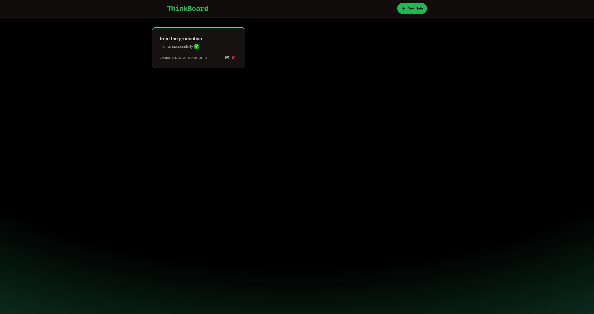
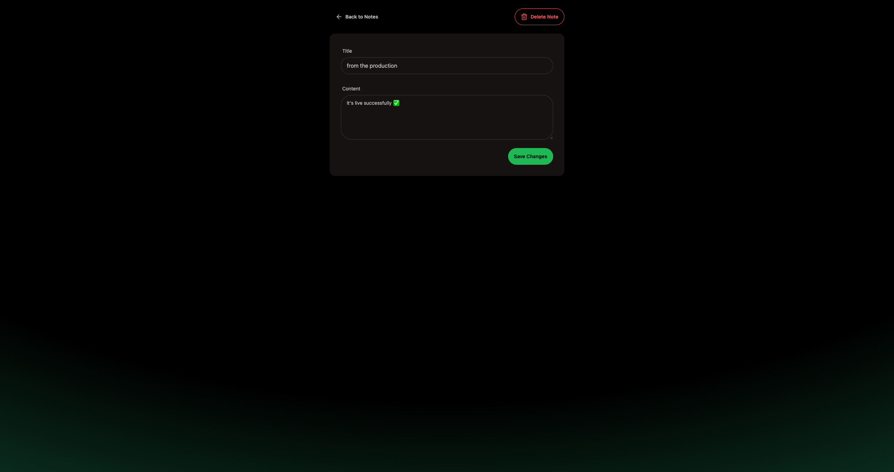
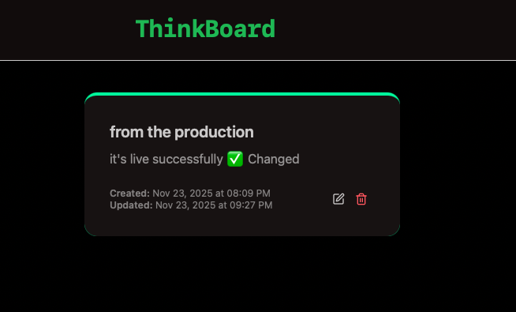
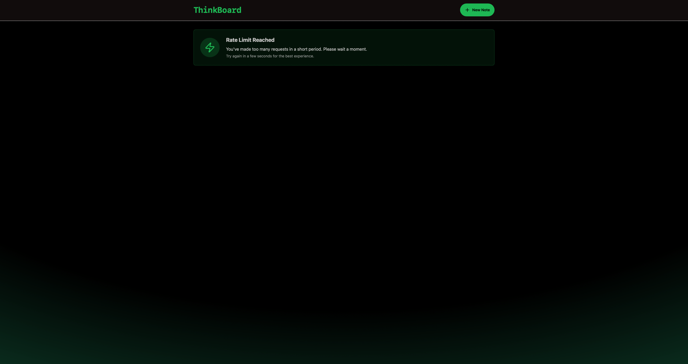

# ThinkBoard 📝

**ThinkBoard** is a modern web application for creating and managing notes with a clean interface and built-in rate-limiting. Perfect for quick note-taking and experimenting with frontend and backend development.

---

## 🚀 Demo

### Video
[Watch Demo](assets/videos/demo.mp4)  

### Screenshots
**Homepage**  
  

**Create Note Page**  
  

**Note View**  
  

**Rate Limit Notification**  
  

---

## ✨ Features / Advantages

- Full CRUD for notes: create, edit, delete, and view.  
- Rate limiting to protect the server from abuse.  
- Fast and modern interface with React + Vite.  
- Configurable MongoDB Atlas and Redis (Upstash) integration.  
- Easy local setup and development.  
- Clear project structure for learning and experimentation.  

---

## ⚙️ Installation / Setup

1. Clone the repository: 

git https://github.com/Krayker01/MERN-ToDo.git

2. Configure .env
In the backend folder, create a .env file and add your credentials:
MONGO_URI="mongodb+srv://<username>:<password>@cluster0.mongodb.net/mydatabase?retryWrites=true&w=majority"
PORT="3000"
UPSTASH_REDIS_REST_URL="https://<your-upstash-url>.upstash.io"
UPSTASH_REDIS_REST_TOKEN="<your-upstash-token>"
NODE_ENV="development"

Where to get these values:

MongoDB Atlas (MONGO_URI):
Sign up on https://www.mongodb.com/products/platform/atlas-database.
Create a cluster and a database user.
Copy the connection string for your app.

Upstash Redis (UPSTASH_REDIS_REST_URL & UPSTASH_REDIS_REST_TOKEN):
Sign up on https://upstash.com.
Create a new Redis database.
Copy the REST URL and access token.

⚠️ Never commit your .env with keys to a public repository.

## 3. Build and run the project

Build frontend (from project root):
npm run build

Run backend:
cd backend
npm install
npm run dev

Run frontend:
cd frontend/thinkboard
npm install
npm run dev

Open your browser and go to:
http://localhost:5173/

Now both frontend and backend should be running locally.
Frontend is on port 5173
Backend is on port 3000

## 4. Development Mode
Make sure .env has:
NODE_ENV="development"

## ⚠️ Possible Issues
- **CORS errors**:  
  If the frontend cannot connect to backend on port 3000, make sure backend is running and CORS headers are properly configured.
- **MongoDB or Upstash not connecting**:  
  Check that the URI and tokens are correctly copied.

---

## 📝 Notes
- Screenshots go in: `frontend/thinkboard/src/assets/images/`  
- Demo video goes in: `frontend/thinkboard/src/assets/videos/`

---

## 📂 Project Structure

project-root/
├── assets/
│ ├── images/
│ └── videos/
├── backend/
│ ├── node_modules/
│ ├── src/
│ │ ├── config/
│ │ │ ├── db.js
│ │ │ └── upstash.js
│ │ ├── controllers/
│ │ │ └── notesController.js
│ │ ├── middleware/
│ │ │ └── rateLimiter.js
│ │ ├── models/
│ │ │ └── Note.js
│ │ ├── routes/
│ │ │ └── notesRoutes.js
│ │ └── server.js
│ ├── .env
│ ├── package.json
│ └── package-lock.json
├── frontend/
│ └── thinkboard/
│ ├── dist/
│ │ ├── assets/
│ │ │ ├── index-DUTLyb2t.css
│ │ │ └── index-eRsRX_16.js
│ │ ├── index.html
│ │ └── vite.svg
│ ├── node_modules/
│ ├── public/
│ ├── src/
│ │ ├── components/
│ │ │ ├── Navbar.jsx
│ │ │ ├── NoteCard.jsx
│ │ │ └── RateLimitUI.jsx
│ │ ├── lib/
│ │ │ ├── axios.js
│ │ │ └── utils.js
│ │ ├── pages/
│ │ │ ├── CreatePage.jsx
│ │ │ ├── HomePage.jsx
│ │ │ ├── NoteDetailPage.jsx
│ │ │ └── NotesNotFound.jsx
│ │ ├── App.jsx
│ │ ├── index.css
│ │ └── main.jsx
│ ├── eslint.config.js
│ ├── index.html
│ ├── package.json
│ ├── package-lock.json
│ ├── postcss.config.js
│ ├── README.md
│ ├── tailwind.config.js
│ ├── vite.config.js
│ └── package-lock.json
├── .gitignore
└── package.json

---

## ⚙️ Backend (/backend/src)
- `server.js` – Entry point of the backend server (Express initialization)  
- `config/db.js` – Database connection configuration  
- `config/upstash.js` – Upstash Redis client configuration  
- `controllers/notesController.js` – Core logic for handling note-related requests  
- `routes/notesRoutes.js` – API routes for notes  
- `models/Note.js` – Mongoose/Schema model for notes  
- `middleware/rateLimiter.js` – Rate-limiting middleware to protect API from excessive requests  

---

## 🖥️ Frontend (/frontend/thinkboard/src)
- `App.jsx` – Main React component defining the app layout and routing  
- `main.jsx` – Frontend entry point for Vite + React  

**Components**
- `Navbar.jsx` – Navigation bar component  
- `NoteCard.jsx` – UI component for displaying individual notes  
- `RateLimitUI.jsx` – UI state for handling rate-limit errors  

**Pages**
- `HomePage.jsx` – Main page listing notes  
- `CreatePage.jsx` – Page for creating a note  
- `NoteDetailPage.jsx` – Page showing a single note  
- `NotesNotFound.jsx` – “Not Found” page for invalid note IDs  

**Lib**
- `axios.js` – Configured Axios instance for API calls  
- `utils.js` – Helper utility functions  

- `index.css` – Global styles  
- `index.html` – Vite HTML template